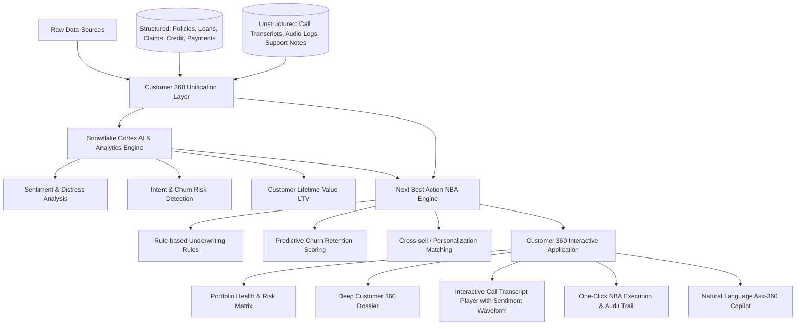

# Implementation Plan - Customer 360 & Next-Best-Action (NBA) Engine

Build an enterprise-grade prototype for insurers and lenders that unifies structured data (policies, loans, claims, payments) and unstructured touchpoints (call transcripts, support tickets, sentiment signals) into an intuitive Customer 360 view, powered by a Next-Best-Action (NBA) recommendation engine and an AI Copilot.

---

## User Review Required

> [!IMPORTANT]
> **Tech Stack Selection:**
> - **Backend & Services:** Node.js + Express + TypeScript (modular architecture for data ingest, sentiment analysis, NBA scoring, and natural language copilot).
> - **Frontend Application:** React 18 + Vite + TypeScript + Lucide Icons + custom modern CSS design system (dark-mode glassmorphism, responsive data visualizations, transcript timeline player).
> - **Snowflake Integration:** Native Snowflake Cortex AI architecture blueprint, Cortex SQL queries (`SNOWFLAKE.CORTEX.SENTIMENT`, `COMPLETE`, `EXTRACT_ANSWER`), and Iceberg / Hybrid table schemas.
> - **Testing & Verification:** Automated TypeScript test runner (`npm test`) validating the NBA rules engine, transcript sentiment analysis, and API endpoints.

---

## Proposed Features & System Architecture

### Key Modules to Implement

1. **Synthetic Multi-Domain Dataset (`src/data/`)**:
   - Realistic insurance & lending profiles (auto, home, life, commercial, mortgages, personal loans).
   - High-fidelity call transcripts with speaker diarization, timestamps, sentiment tags, and intent triggers.
   - Comprehensive claims, credit scores, policy tenures, and churn indicators.

2. **Customer 360 & Cortex Analytics Engine (`src/services/`)**:
   - Transcript parsing and sentiment scoring engine (simulating Snowflake Cortex `SNOWFLAKE.CORTEX.SENTIMENT`).
   - Unified profile aggregation combining structured metrics and unstructured signals into an executive risk & opportunity index.

3. **Next-Best-Action (NBA) Engine (`src/services/nbaEngine.ts`)**:
   - Multi-factor evaluation: Churn Risk, Underwriting Risk Tier, Lifetime Value (LTV), Interaction Sentiment, and Policy Milestone triggers.
   - Ranked recommendations with Confidence Score, Expected Business Impact ($ / % retention), Detailed Rationale, and One-Click Action Dispatcher.

4. **Natural Language Customer 360 Copilot (`src/services/copilotService.ts`)**:
   - Context-grounded assistant answering queries (e.g. *"Why is Michael at risk of churning?"*, *"What discounts can we offer Sarah based on her last call?"*) with structured citations and instant actionable buttons.

5. **Modern Single-Page Application (`src/client/`)**:
   - **Portfolio Overview:** KPI ribbon, customer segment filters (High Churn, VIP, Underwriting Review, Claim Pending).
   - **Customer 360 Dossier:** Unified summary header, active policies/loans cards, claims ledger, interactive interaction timeline.
   - **Interactive Transcript Center:** Playable call timeline, utterance-by-utterance sentiment badge, key concerns extracted.
   - **NBA Action Matrix:** Prioritized action cards with direct "Execute Action" capability that updates customer state in real-time.
   - **Ask-360 Copilot Drawer:** Interactive chat drawer with quick prompt pills.
   - **Snowflake Cortex Inspector Modal:** Real-time view of the Snowflake SQL DDL, Cortex queries, and architectural flow.

6. **Automated Verification Suite (`src/tests/verify.ts`)**:
   - Unit and integration tests covering Customer 360 aggregation, sentiment parsing, NBA scoring logic, and API route responses.

7. **Documentation Updates (`README.md`)**:
   - Complete architectural overview, quickstart instructions, data model explanation, Snowflake Cortex integration details, and demo walkthrough.

---

## Proposed Changes

### Project Setup & Configuration
- [NEW] [`package.json`](file:///c:/Users/Administration/Desktop/VibeCoding/Snowflake/Customer-360-and-Next-Best-Action-Engine/package.json): NPM dependencies (React, Vite, Express, TypeScript, Lucide-react, tsx, etc.)
- [NEW] [`tsconfig.json`](file:///c:/Users/Administration/Desktop/VibeCoding/Snowflake/Customer-360-and-Next-Best-Action-Engine/tsconfig.json): TypeScript configuration
- [NEW] [`vite.config.ts`](file:///c:/Users/Administration/Desktop/VibeCoding/Snowflake/Customer-360-and-Next-Best-Action-Engine/vite.config.ts): Vite build and dev server config with backend API proxy
- [NEW] [`index.html`](file:///c:/Users/Administration/Desktop/VibeCoding/Snowflake/Customer-360-and-Next-Best-Action-Engine/index.html): HTML root with modern typography and metadata

### Server & Engine Layer
- [NEW] [`src/server/index.ts`](file:///c:/Users/Administration/Desktop/VibeCoding/Snowflake/Customer-360-and-Next-Best-Action-Engine/src/server/index.ts): Express server exposing REST API endpoints
- [NEW] [`src/types/index.ts`](file:///c:/Users/Administration/Desktop/VibeCoding/Snowflake/Customer-360-and-Next-Best-Action-Engine/src/types/index.ts): Shared TypeScript interfaces for Customer, Policy, Loan, Claim, Interaction, Transcript, NBA, and Copilot
- [NEW] [`src/data/mockCustomers.ts`](file:///c:/Users/Administration/Desktop/VibeCoding/Snowflake/Customer-360-and-Next-Best-Action-Engine/src/data/mockCustomers.ts): Realistic insurance & lending dataset with rich call transcripts
- [NEW] [`src/services/customerService.ts`](file:///c:/Users/Administration/Desktop/VibeCoding/Snowflake/Customer-360-and-Next-Best-Action-Engine/src/services/customerService.ts): Customer 360 profile aggregation and state management
- [NEW] [`src/services/nbaEngine.ts`](file:///c:/Users/Administration/Desktop/VibeCoding/Snowflake/Customer-360-and-Next-Best-Action-Engine/src/services/nbaEngine.ts): Next Best Action recommendation algorithm
- [NEW] [`src/services/cortexService.ts`](file:///c:/Users/Administration/Desktop/VibeCoding/Snowflake/Customer-360-and-Next-Best-Action-Engine/src/services/cortexService.ts): Transcript sentiment analysis, intent extraction, and Snowflake Cortex SQL generators
- [NEW] [`src/services/copilotService.ts`](file:///c:/Users/Administration/Desktop/VibeCoding/Snowflake/Customer-360-and-Next-Best-Action-Engine/src/services/copilotService.ts): Natural language Q&A and action recommender

### Frontend Application Layer
- [NEW] [`src/client/main.tsx`](file:///c:/Users/Administration/Desktop/VibeCoding/Snowflake/Customer-360-and-Next-Best-Action-Engine/src/client/main.tsx): React root mount
- [NEW] [`src/client/App.tsx`](file:///c:/Users/Administration/Desktop/VibeCoding/Snowflake/Customer-360-and-Next-Best-Action-Engine/src/client/App.tsx): Master application shell and state orchestrator
- [NEW] [`src/client/index.css`](file:///c:/Users/Administration/Desktop/VibeCoding/Snowflake/Customer-360-and-Next-Best-Action-Engine/src/client/index.css): Premium design system (dark mode, glassmorphic cards, glowing badges, responsive grid)
- [NEW] [`src/client/components/Header.tsx`](file:///c:/Users/Administration/Desktop/VibeCoding/Snowflake/Customer-360-and-Next-Best-Action-Engine/src/client/components/Header.tsx): Top navigation with metrics bar, search, and Snowflake Cortex modal trigger
- [NEW] [`src/client/components/CustomerList.tsx`](file:///c:/Users/Administration/Desktop/VibeCoding/Snowflake/Customer-360-and-Next-Best-Action-Engine/src/client/components/CustomerList.tsx): Searchable customer roster with risk badges and filter pills
- [NEW] [`src/client/components/Customer360View.tsx`](file:///c:/Users/Administration/Desktop/VibeCoding/Snowflake/Customer-360-and-Next-Best-Action-Engine/src/client/components/Customer360View.tsx): Unified 360 overview tab (demographics, policies, claims, financial health)
- [NEW] [`src/client/components/TranscriptViewer.tsx`](file:///c:/Users/Administration/Desktop/VibeCoding/Snowflake/Customer-360-and-Next-Best-Action-Engine/src/client/components/TranscriptViewer.tsx): Rich transcript reader with audio simulator, speaker badges, sentiment highlights, and extracted entities
- [NEW] [`src/client/components/NBACards.tsx`](file:///c:/Users/Administration/Desktop/VibeCoding/Snowflake/Customer-360-and-Next-Best-Action-Engine/src/client/components/NBACards.tsx): Next-Best-Action recommendation cards with rationale and one-click execution
- [NEW] [`src/client/components/CopilotModal.tsx`](file:///c:/Users/Administration/Desktop/VibeCoding/Snowflake/Customer-360-and-Next-Best-Action-Engine/src/client/components/CopilotModal.tsx): Interactive AI copilot chat with contextual customer memory
- [NEW] [`src/client/components/SnowflakeCortexModal.tsx`](file:///c:/Users/Administration/Desktop/VibeCoding/Snowflake/Customer-360-and-Next-Best-Action-Engine/src/client/components/SnowflakeCortexModal.tsx): Live Snowflake architecture preview with executable Cortex SQL

### Testing & Verification
- [NEW] [`src/tests/verify.ts`](file:///c:/Users/Administration/Desktop/VibeCoding/Snowflake/Customer-360-and-Next-Best-Action-Engine/src/tests/verify.ts): Automated test runner validating NBA algorithms, sentiment scoring, and customer state updates.

### Documentation
- [MODIFY] [`README.md`](file:///c:/Users/Administration/Desktop/VibeCoding/Snowflake/Customer-360-and-Next-Best-Action-Engine/README.md): Comprehensive documentation covering Architecture, Features, Real-world relevance, Quickstart, and Snowflake integration.

---

## Verification Plan

### Automated Tests
- Run `npm test` (executes `src/tests/verify.ts` via `tsx`):
  - Validates customer profile loading and calculations.
  - Validates transcript sentiment scoring logic against ground truth.
  - Tests NBA scoring engine to ensure high-risk/high-churn triggers recommend retention actions.
  - Verifies action dispatch and timeline mutation.

### Manual / Browser Verification
- Build and run the app with `npm run build` and launch dev server.
- Verify through browser:
  - Navigation between customer profiles.
  - Transcript inspection with sentiment visualization.
  - One-click NBA recommendation execution (e.g. "Apply 15% Churn Retention Discount") updating customer state and activity timeline in real-time.
  - Natural Language Copilot query answering with customer citations.
  - Snowflake Cortex modal showing realistic SQL & architecture.
